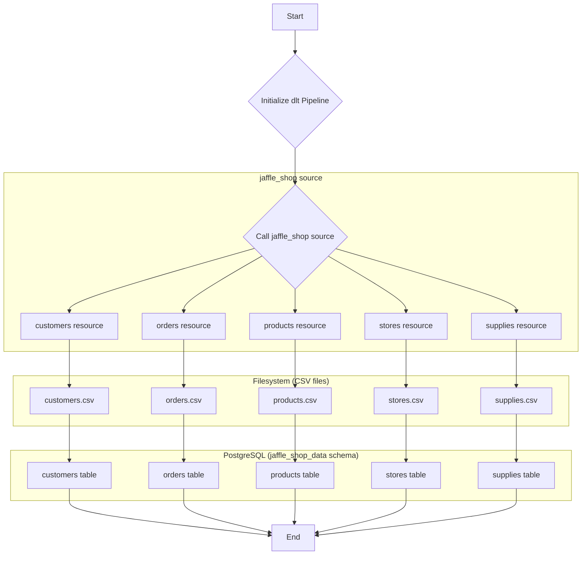

# Jaffle Shop Pipeline

This pipeline demonstrates loading data from a local filesystem into a PostgreSQL database using `dlt`. It reads multiple CSV files representing Jaffle Shop data and loads them into separate tables.

## Pipeline Components

- **Data Source**: CSV files (`customers.csv`, `orders.csv`, `products.csv`, `stores.csv`, `supplies.csv`) located in the `filesystem/incoming` directory.
- **ETL Tool**: `dlt` (data load tool) Python library.
- **Destination**: A PostgreSQL database instance.

## Workflow

The pipeline executes the following steps:

1.  **Initialization**: A `dlt` pipeline is initialized with the name `jaffle_shop_pipeline`, a `postgres` destination, and the dataset name `jaffle_shop_data`.
2.  **Data Loading**: The `jaffle_shop` source reads the various CSV files from the filesystem.
3.  **Table Creation**: `dlt` creates tables in the `jaffle_shop_data` schema corresponding to the CSV files (`customers`, `orders`, `products`, `stores`, `supplies`).
4.  **Data Insertion**: The data from the CSV files is inserted into the corresponding tables.
5.  **Termination**: The pipeline run finishes, and load information is printed to the console.

### Workflow Diagram

## Data Schema

The pipeline creates the following tables in the `jaffle_shop_data` schema in the PostgreSQL database:

- `customers`
- `orders`
- `products`
- `stores`
- `supplies`

The columns in each table are inferred by `dlt` from the headers in the respective CSV files. `dlt` also adds its own metadata columns (`_dlt_load_id`, `_dlt_id`) for internal tracking.
