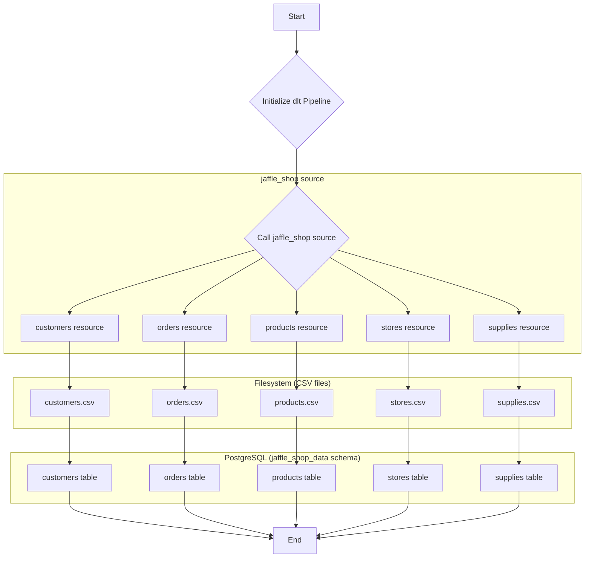
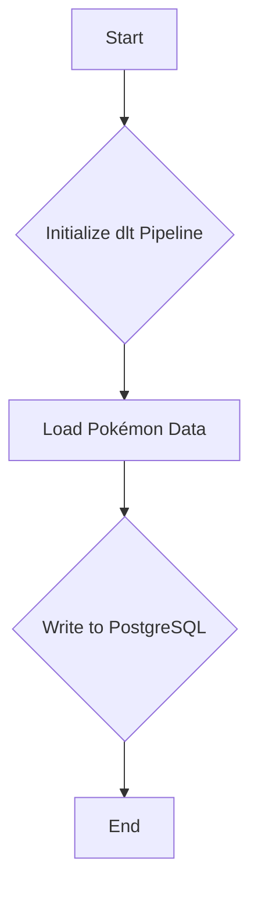

# DLT (Data Loading Tool)

The goal of this project is to build data pipeline to combine raw data from different sources. This tool helps facilitate transformation of data using DBT inside the warehouse to provide self-service data outlet for analysts and internal stakeholders. 

---

## Jaffle Shop Demo

This pipeline demonstrates loading data from a local filesystem into a PostgreSQL database using `dlt`. It reads multiple CSV files representing Jaffle Shop data and loads them into separate tables.

### Pipeline Components

- **Data Source**: CSV files (`customers.csv`, `orders.csv`, `products.csv`, `stores.csv`, `supplies.csv`) located in the `filesystem/incoming` directory.
- **ETL Tool**: `dlt` (data load tool) Python library.
- **Destination**: A PostgreSQL database instance.

### Workflow

he pipeline executes the following steps:

1.  **Initialization**: A `dlt` pipeline is initialized with the name `jaffle_shop_pipeline`, a `postgres` destination, and the dataset name `jaffle_shop_data`.
2.  **Data Loading**: The `jaffle_shop` source reads the various CSV files from the filesystem directory the incoming folder.
3.  **Table Creation**: `dlt` creates tables in the `jaffle_shop_data` schema corresponding to the CSV files (`customers`, `orders`, `products`, `stores`, `supplies`) or replaces existing ones. 
4.  **Data Insertion**: The data from the CSV files is inserted into the corresponding tables.
5.  **Termination**: The pipeline run finishes, and load information is printed to the console.

#### Workflow Diagram

#### Data Schema

The pipeline creates the following tables in the `jaffle_shop_data` schema in the PostgreSQL database:

- `customers`
- `orders`
- `products`
- `stores`
- `supplies`

The columns in each table are inferred by `dlt` from the headers in the respective CSV files. `dlt` also adds its own metadata columns (`_dlt_load_id`, `_dlt_id`) for internal tracking.

---

## Toy Pipeline Demo

This pipeline demonstrates a simple data loading process using the `dlt`. It loads a predefined list of Pokémon data into a PostgreSQL database.

### Pipeline Components

- **Data Source**: A static list of Pokémon data defined within the Python script.
- **ETL Tool**: `dlt` (data load tool) Python library used to create and run the pipeline.
- **Destination**: A PostgreSQL database instance.

### Workflow

The pipeline executes the following steps:

1.  **Initialization**: `dlt` pipeline is initialized with a specified pipeline name, destination, and dataset name.
2.  **Data Loading**: Sample Pokémon data is loaded into a PostgreSQL table named `pokemon` within the `pokemon_data` dataset (schema).
3.  **Termination**: The pipeline run finishes, and information about the load is printed to the console.

#### Workflow Diagram

#### Data Schema

The data being processed has the following structure:

- `id`: (string) The Pokémon's ID.
- `name`: (string) The Pokémon's name.
- `size`: (object) An object containing the Pokémon's size information.
    - `weight`: (float) The Pokémon's weight.
    - `height`: (float) The Pokémon's height.

The data is loaded into a table named `pokemon`. `dlt` will creates following columns:

- `id` (text)
- `name` (text)
- `size__weight` (float)
- `size__height` (float)
- `_dlt_load_id` (text)
- `_dlt_id` (text)

The `size` object is flattened into separate columns `size__weight` and `size__height` by `dlt`. The `_dlt_load_id` and `_dlt_id` columns are added by `dlt` for internal tracking.

